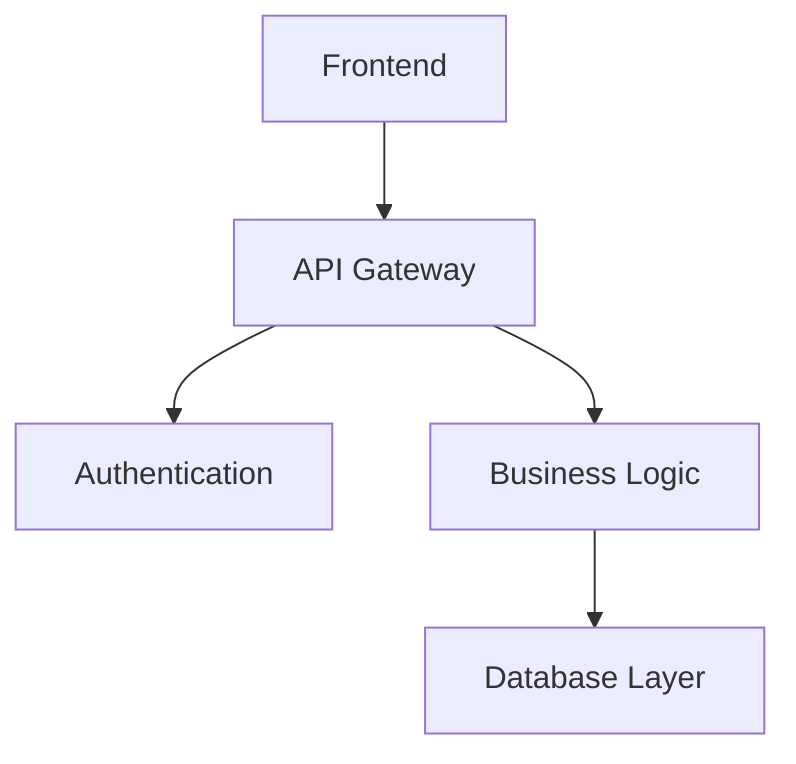

# Code Documentation Vault

Welcome to the networked code documentation system! This vault demonstrates how to organize and link code documentation using Obsidian.

## Core Concepts

- [Authentication System](../02-backend/auth/Authentication System.md) - User login and security
- [Database Layer](../02-backend/database/Database Layer.md) - Data persistence and queries
- [API Design](../02-backend/api/API Design.md) - RESTful endpoints and responses
- [Frontend Components](../03-frontend/Frontend Components.md) - React UI components
- [Testing Strategy](../04-testing/Testing Strategy.md) - Unit and integration tests

## Architecture Overview

## Quick Navigation

- [User Management](../02-backend/User Management.md) - Core user operations
- [Error Handling](../02-backend/Error Handling.md) - System-wide error patterns
- [Configuration](../05-operations/Configuration.md) - Environment and settings
- [Deployment](Deployment.md) - CI/CD and infrastructure

#documentation #architecture #overview
