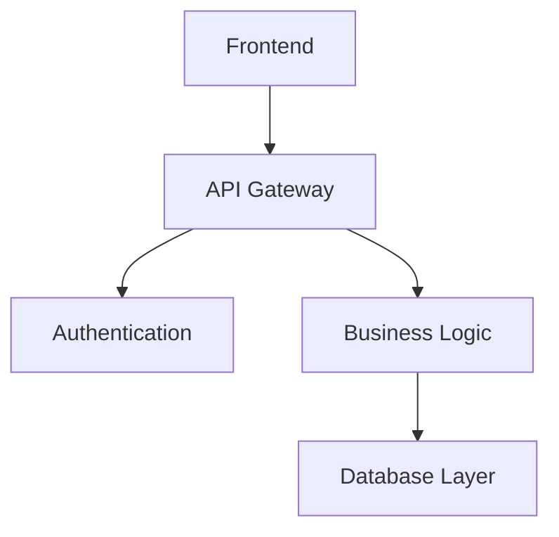

# Code Documentation Vault

Welcome to the networked code documentation system! This vault demonstrates how to organize and link code documentation using Obsidian.

## Core Concepts

- [[Authentication System]] - User login and security
- [[Database Layer]] - Data persistence and queries
- [[API Design]] - RESTful endpoints and responses
- [[Frontend Components]] - React UI components
- [[Testing Strategy]] - Unit and integration tests

## Architecture Overview

## Quick Navigation

- [[User Management]] - Core user operations
- [[Error Handling]] - System-wide error patterns
- [[Configuration]] - Environment and settings
- [[Deployment]] - CI/CD and infrastructure

#documentation #architecture #overview
