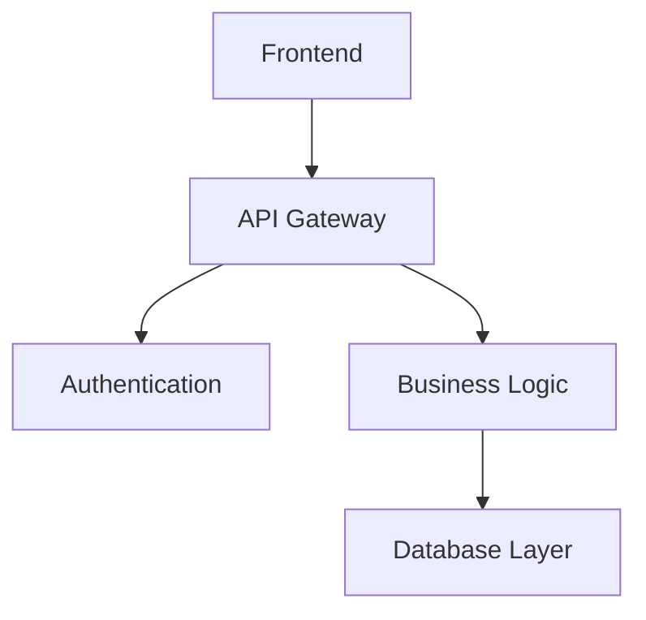

# Code Documentation Vault

Welcome to the networked code documentation system! This vault demonstrates how to organize and link code documentation using Obsidian.

## Core Concepts

- [Authentication System](Authentication%20System.md) - User login and security
- [Database Layer](Database%20Layer.md) - Data persistence and queries
- [API Design](API%20Design.md) - RESTful endpoints and responses
- [Frontend Components](Frontend%20Components.md) - React UI components
- [Testing Strategy](Testing%20Strategy.md) - Unit and integration tests

## Architecture Overview

## Quick Navigation

- [User Management](User%20Management.md) - Core user operations
- [Error Handling](Error%20Handling.md) - System-wide error patterns
- [Configuration](Configuration.md) - Environment and settings
- [Deployment](Deployment.md) - CI/CD and infrastructure

#documentation #architecture #overview
