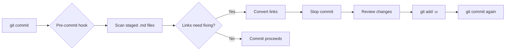

# 🔧 GitHub-Friendly Obsidian Vault Setup Guide

This vault includes automated tools to maintain compatibility between Obsidian and GitHub. Here's how to set up and use them.

## ⚡ Quick Setup

### 1. Pre-commit Hook (Recommended)
The pre-commit hook automatically converts links when you commit:

```bash
# Already set up! The hook is at .git/hooks/pre-commit
# It automatically runs when you commit changes
git add .
git commit -m "Your changes"  # Hook runs automatically
```

**What the hook does:**
- ✅ Converts `[Obsidian links](Obsidian%20links.md)` → `[GitHub links](File%20Name.md)`  
- ✅ Fixes URL encoding issues (`%20` → `%20`)
- ✅ Handles spaces in filenames properly
- ✅ Shows you what was changed before committing

### 2. Manual Conversion Script
You can also run conversions manually:

```bash
# Convert all .md files in the vault
python3 scripts/convert-obsidian-links.py

# Convert specific files  
python3 scripts/convert-obsidian-links.py README.md "Authentication System.md"
```

## 🔄 How It Works

### Pre-commit Workflow


### Conversion Examples

**Before (Obsidian format):**
```markdown
See [Authentication System](Authentication%20System.md) for login details.
The [Database Layer](Database%20Layer.md) handles persistence.
Check [API Design](API%20Design.md) for endpoints.
```

**After (GitHub-compatible):**
```markdown
See [Authentication System](Authentication%20System.md) for login details.
The [Database Layer](Database%20Layer.md) handles persistence.  
Check [API Design](API%20Design.md) for endpoints.
```

## 🛠️ Advanced Usage

### Custom Hook Configuration
Edit `.git/hooks/pre-commit` to customize behavior:

```bash
# Skip conversion for specific files
if ["$file" == "CHANGELOG.md"](%22%24file%22%20%3D%3D%20%22CHANGELOG.md%22.md); then
    continue
fi

# Add custom conversion patterns
# (modify the Python script in scripts/)
```

### Batch Processing
Convert all files in specific directories:

```bash
# Convert only backend docs
find 02-backend -name "*.md" -exec python3 scripts/convert-obsidian-links.py {} \;

# Convert and show detailed changes
python3 scripts/convert-obsidian-links.py 02-backend/*.md
```

### Integration with Obsidian
The conversion maintains full Obsidian compatibility:

- **Graph View**: Still shows all connections
- **Backlinks**: Work with converted links  
- **Hover Preview**: Functions normally
- **Auto-completion**: Suggests existing files
- **Search**: Finds linked content

## 🔍 Troubleshooting

### Hook Not Running?
```bash
# Check if hook exists and is executable
ls -la .git/hooks/pre-commit

# Make it executable if needed
chmod +x .git/hooks/pre-commit

# Test the hook manually
.git/hooks/pre-commit
```

### Links Still Broken?
Run the diagnostic script:

```bash
# Check for encoding issues
python3 scripts/convert-obsidian-links.py --verbose

# Look for common problems
grep -r "\[\[" *.md                    # Find remaining Obsidian links
grep -r "] (" *.md                     # Find unencoded spaces  
grep -r "%20" *.md                   # Find double-encoded URLs
```

### Performance Issues?
For large vaults (100+ files):

```bash
# Process files in batches
find . -name "*.md" | head -20 | xargs python3 scripts/convert-obsidian-links.py

# Skip hook for large commits
git commit --no-verify -m "Bulk changes"
# Then run conversion manually
python3 scripts/convert-obsidian-links.py
git add -u && git commit -m "Fix links"
```

## 📋 Best Practices

### For Content Creators

1. **Write naturally in Obsidian** using `[double brackets](double%20brackets.md)`
2. **Let the tools convert** links automatically on commit
3. **Review changes** before committing to catch any issues
4. **Test links** occasionally in GitHub to verify they work

### For Collaborators

1. **Clone with hooks**: `git clone <repo> && cd <repo> && chmod +x .git/hooks/pre-commit`
2. **Install Python 3**: Required for link conversion
3. **Follow the workflow**: Write → Stage → Commit (hook runs) → Review → Commit again
4. **Report issues**: If links don't convert properly

### For AI Agents

1. **Use standard markdown links** from the start: `[Text](file.md)`
2. **URL-encode spaces**: `File%20Name.md` not `File Name.md`  
3. **Check relative paths**: Ensure links work from file's location
4. **Follow the [Agent Guide](agent.md)** for detailed guidelines

## 🔄 Migration Guide

### From Pure Obsidian Vault
```bash
1. Copy your existing vault files to this repository
2. Run: python3 scripts/convert-obsidian-links.py
3. Review the changes: git diff
4. Commit: git add -u && git commit -m "Convert to GitHub-compatible links"
```

### From Pure GitHub Repo
```bash
1. Copy markdown files to vault structure (01-architecture/, 02-backend/, etc.)
2. Open in Obsidian and use normally
3. Links already work - no conversion needed!
```

## 🎯 Validation

### Test Your Setup
```bash
# 1. Create a test file with Obsidian links
echo "# Test\nSee [Authentication System](Authentication%20System.md) for details." > test.md

# 2. Stage and commit
git add test.md
git commit -m "Test conversion"

# 3. Check the result
cat test.md
# Should show: See [Authentication System](Authentication%20System.md) for details.

# 4. Clean up
rm test.md
```

### Verify GitHub Compatibility
1. Push changes to GitHub
2. Navigate to any documentation file
3. Click cross-reference links
4. Verify they lead to correct files (not 404 errors)

## 📚 Additional Resources

- [Agent Guide](agent.md) - Guidelines for AI agents
- [Original Obsidian files](https://obsidian.md/help/How+to/Format+your+notes) - Obsidian linking syntax
- [GitHub Markdown](https://guides.github.com/features/mastering-markdown/) - GitHub-specific features

---

*This setup ensures your vault works beautifully in both Obsidian and GitHub, with minimal manual intervention required.*

#setup #automation #obsidian #github #tools
